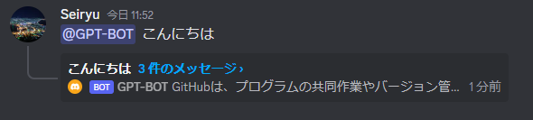
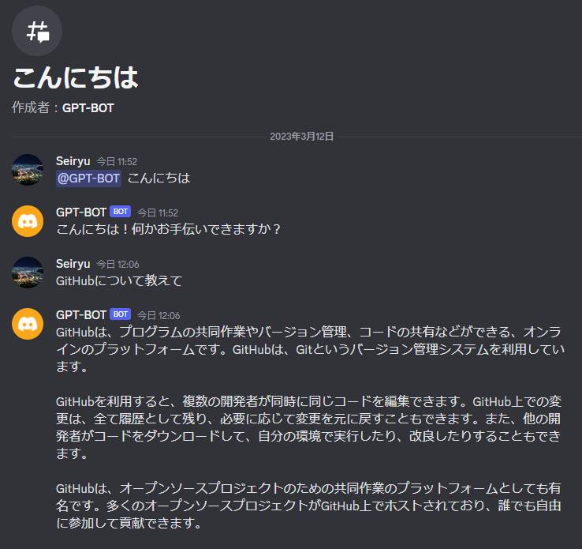

# Discord.gpt

OpenAIのAPI(gpt-3.5-turbo)を用いたDiscord Botです。

ChatGPT風の会話がDiscord上で行えます。

## 環境変数
環境変数でBOTの各種設定が行なえます

- `BOT_TOKEN`
  - DiscordのBot Token

- `OPENAI_API_KEY` 
  - OpenAIのAPI Key

- `GPT_SYSTEM_MESSAGE`
  - 会話の入力の最初に挿入されるSystem Roleのメッセージを指定。
  - 例 「 You are a helpful assistant. 」

- `GPT_TEMP`
  - サンプリング温度を 0〜1 の間で指定

- `GPT_MAX_TOKENS`
  - 生成されるレスポンスのトークン最大数

## サンプル画像

